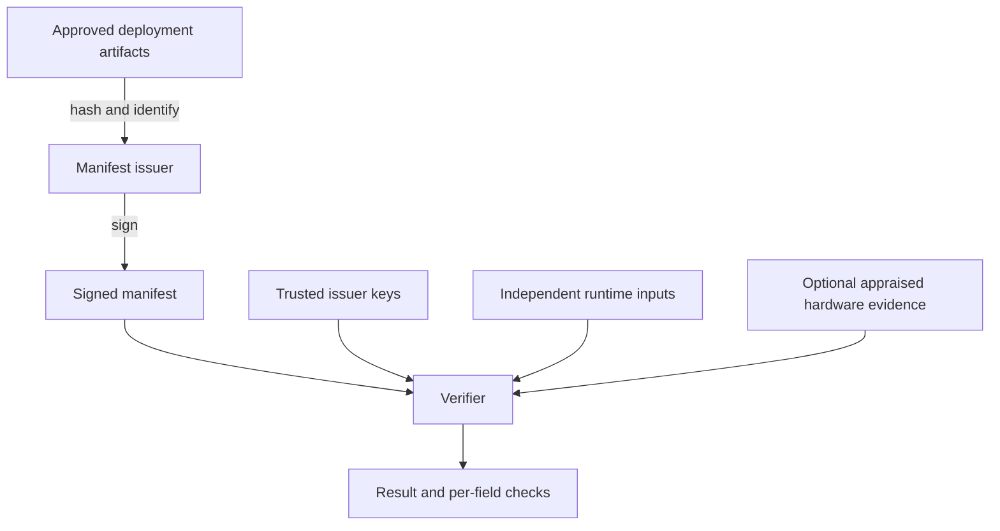

---
hide:
  - navigation
  - toc
title: "Agent Manifest: a signed, checkable record of an agent"
description: Sign an agent configuration, verify its artifact bindings against independent inputs, and detect changes. Start locally with software signing.
---

[02 · Agent: what is this agent, and what is it allowed to do?](https://agentrust-io.com/#chain)

# Check the agent you approved against what deployed

Agent Manifest signs an agent's prompt, policy, tools, model identity and six further artifact bindings, so a verifier can authenticate the issuer and compare each binding with inputs it trusts.

[Create and check your first manifest](getting-started.md){ .md-button .md-button--primary }
[What this proves, and what it does not](limitations.md){ .md-button }

!!! tip "TL;DR"
    [agent-manifest](https://pypi.org/project/agent-manifest/) 0.12.0 (Apache-2.0) signs and verifies locally with Python 3.11+ and no hardware or cloud account. Its SEV-SNP path was validated on an Azure confidential VM ([#227](https://github.com/agentrust-io/agent-manifest/pull/227)) and its TDX quote verifier on a GCP C3 guest, and a manifest still does not observe the agent after issuance: runtime activity is recorded separately in [TRACE](https://trace.agentrust-io.com/).

-   __Run it__

    ---

    Sign a demo configuration, check it, then detect an edited record and a different prompt hash.

    [Getting started](getting-started.md)

-   __What it proves, and what it does not__

    ---

    A signature check is one part of verification. The verifier needs its own trusted inputs.

    [Limitations](limitations.md)

-   __Hardware evidence__

    ---

    TPM, AMD SEV-SNP and Intel TDX providers. A provider name is not an assurance verdict.

    [Hardware attestation](tutorials/hardware-attestation.md)

-   __The chain__

    ---

    Before it: [Weight Custody Manifest](https://wcm.agentrust-io.com) for the weights. After it: [cMCP](https://cmcp.agentrust-io.com) for tool calls and [cA2A](https://ca2a.agentrust-io.com) for delegation. Check a real TDX quote at [agentrust-io.com/verify](https://agentrust-io.com/verify/).

    [See the chain](https://agentrust-io.com/#chain)

## The agent attestation gap

An authenticated caller can still run a changed prompt, policy, or tool configuration. A manifest gives a verifier specific artifact bindings to compare. Software signing authenticates declarations; hardware provenance requires valid attestation, approved measurements, and a binding between the evidence and this manifest.

## How it works

Scroll the diagram horizontally on smaller screens.

The verifier needs its own trusted inputs. A signed manifest does not continuously observe the agent, and attestation does not make every later modification impossible. Runtime activity is recorded separately in [TRACE](https://trace.agentrust-io.com/).

## The 10 attested artifacts

The format covers these ten categories. Their presence and verification requirements depend on the profile; a category listed here is not evidence that it was measured or checked.

| Artifact | What the binding identifies |
|---|---|
| System prompt | Prompt hash, version, and classification |
| Policy bundle | Policy hash, language, and declared enforcement mode |
| Tool manifest | Tool catalog hash |
| Model identity | Provider, model, version, and attestation type |
| RAG corpus | Corpus commitment |
| Memory baseline | Approved memory snapshot |
| Decision-log baseline | Audit-chain root at issuance |
| A2A delegation | Delegation credentials and scope |
| Supply chain | Image digest and build provenance |
| Human approvals | Approval records and signer evidence |

## Hardware providers

Provider support includes TPM, AMD SEV-SNP, Intel TDX, and OPAQUE. Evidence collection, verification, and memory isolation differ by provider. Use the [hardware guide](tutorials/hardware-attestation.md) and [limitations](limitations.md) to choose a deployment; the provider name alone is not an assurance verdict.

## Conformance levels

Begin with software signing. Higher profiles add hardware, approval, transparency, or cryptographic requirements. Check the [specification](spec/agent-manifest-v0.2.md) before claiming a level; a successful signature check is only one part of verification.

## Frequently asked questions

### What is an Agent Manifest?

A signed record of deployment artifact bindings. Its usefulness depends on authenticating the issuer, comparing independent runtime inputs, and checking the evidence your trust policy requires.

### How is an Agent Manifest different from a signed JWT?

JWT describes an envelope for claims. Agent Manifest defines artifact bindings and their verification contract. Envelope choice alone does not establish runtime provenance.

### Why not specify it as a JWT or JOSE profile?

Because of what comparable standards chose, not because JWT is incapable. The IETF already picked the JWT/CWT route for attestation *tokens*: EAT ([RFC 9711](https://www.rfc-editor.org/rfc/rfc9711.html)) even supports nested tokens and detached claim sets. That is the right shape for "who is calling, right now," and an EAT is a valid input to a manifest's attestation block.

Every multi-artifact provenance standard with a transparency log went the other way. SCITT ([RFC 9943](https://www.rfc-editor.org/rfc/rfc9943.html)), the closest analog to Agent Manifest, mandates COSE_Sign1 signed statements. DSSE, the envelope behind in-toto and SLSA, rejected a JWS profile in writing, citing implementation hazards and canonicalization as attack surface. C2PA uses COSE_Sign1 inside a JUMBF container.

An Agent Manifest is that second kind of object: ten artifacts, several independent signers, hardware-report binding, a 90-day life, and a log receipt attached after signing. So the layering is EAT and JWT for the attestation-token input, and a signed document for the manifest. The two compose. See [ADR-0011](adr/0011-signature-envelope.md) for the full argument. The envelope moves to COSE_Sign1 in spec v0.2 to align with SCITT; v0.1 manifests keep verifying unchanged.

### Does Agent Manifest require special hardware?

No. The [first example](getting-started.md) uses software signing. Hardware provenance requires additional evidence and verification.

### Is Agent Manifest free and open source?

Yes. The source and license are available on [GitHub](https://github.com/agentrust-io/agent-manifest).

## Next steps

- [Getting started](getting-started.md): sign, compare, and detect changes.
- [Tutorials](tutorials/index.md): integration and operational tasks.
- [Specification](spec/agent-manifest-v0.2.md): normative requirements.
- [Architecture decisions](adr/index.md): design rationale.

**Status:** SDK 0.12.0 · Apache-2.0 · proposed to CoSAI WS4 ([RFC #149](https://github.com/cosai-oasis/ws4-secure-design-agentic-systems/issues/149)) · Sponsored by OPAQUE, which funds the engineering, infrastructure and confidential-computing work behind these projects.
