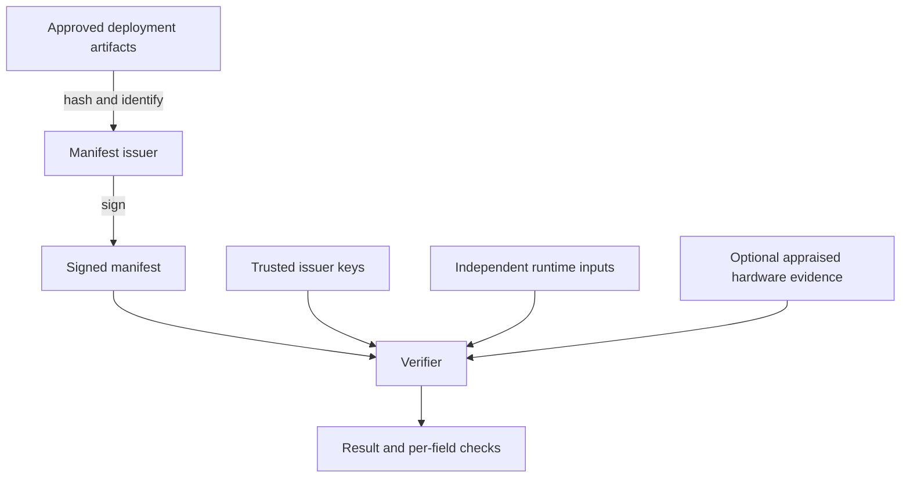

---
hide:
  - navigation
  - toc
title: "Agent Manifest: a signed, checkable record of an agent"
description: Sign an agent configuration, verify its artifact bindings against independent inputs, and detect changes. Start locally with software signing.
---

[02 · Agent: what is this agent, and what is it allowed to do?](https://agentrust-io.com/#chain)

# Check the agent you approved against what deployed

An AI agent is software that uses an AI model to take actions on its own. Agent Manifest is a signed record of how one agent was set up: its instructions (the prompt), its rules (the policy), its tools, its model and six other parts. Anyone checking the agent later can confirm who signed the record and compare each part with what is actually running. New to these terms? See [the terms, in plain English](https://agentrust-io.com/#plain-terms).

[Create and check your first manifest](getting-started.md){ .md-button .md-button--primary }
[What this proves, and what it does not](limitations.md){ .md-button }

!!! tip "TL;DR"
    [agent-manifest](https://pypi.org/project/agent-manifest/) 0.15.0 (Apache-2.0) signs and checks records on your own computer with Python 3.11+, with no special hardware or cloud account. Its AMD SEV-SNP support was tested on an Azure confidential VM ([#227](https://github.com/agentrust-io/agent-manifest/pull/227)) and its Intel TDX report checker on a Google Cloud C3 machine. A manifest does not watch the agent after it is signed: what the agent does is recorded separately in [TRACE](https://trace.agentrust-io.com/).

-   __Run it__

    ---

    Sign a sample agent setup, check it, then watch the check catch an edited record and a changed prompt.

    [Getting started](getting-started.md)

-   __What it proves, and what it does not__

    ---

    A valid signature shows who signed the record. To know the agent matches it, the checker also needs its own trusted view of what is running.

    [Limitations](limitations.md)

-   __Hardware evidence__

    ---

    Optional signed reports from the chip itself (TPM, AMD SEV-SNP, Intel TDX). Supporting a chip type does not by itself prove a given machine can be trusted.

    [Hardware attestation](tutorials/hardware-attestation.md)

-   __The chain__

    ---

    Before it: [Weight Custody Manifest](https://wcm.agentrust-io.com) for the model's weights. After it: [cMCP](https://cmcp.agentrust-io.com) for the agent's tool calls and [cA2A](https://ca2a.agentrust-io.com) for handing work to other agents. Check a real Intel processor report at [agentrust-io.com/verify](https://agentrust-io.com/verify/).

    [See the chain](https://agentrust-io.com/#chain)

## The agent attestation gap

Knowing who is calling does not tell you what they are running. A logged-in agent can still be running a changed prompt, different rules or a new tool. A manifest lists a fingerprint (a hash) of each approved part, so a checker can compare them one by one.

A software signature proves who made those statements. Proving the agent runs on particular hardware takes more: a valid signed report from the processor (called attestation), measurements you have approved, and a link between that report and this manifest.

## How it works

Someone approves the agent's parts and signs a record of them. Later, a checker brings the signer's public key, its own view of what is running and, if wanted, a hardware report, and gets a result for each part. Scroll the diagram sideways on small screens.

```mermaid
flowchart TB
    config[Approved deployment artifacts] -->|hash and identify| issuer[Manifest issuer]
    issuer -->|sign| record[Signed manifest]
    record --> verifier[Verifier]
    keys[Trusted issuer keys] --> verifier
    actual[Independent runtime inputs] --> verifier
    evidence[Optional appraised hardware evidence] --> verifier
    verifier --> result[Result and per-field checks]
```

The checker needs its own trusted inputs; it cannot take the agent's word for what is running. A signed manifest describes the agent at one moment and does not keep watching it, and a hardware report does not rule out every later change. What the agent does while it runs is recorded separately in [TRACE](https://trace.agentrust-io.com/).

## The 10 attested artifacts

A manifest can describe up to ten parts of an agent. Which ones must be present, and how strictly each is checked, depends on the level (profile) you choose. A part appearing in this table does not mean it was measured or checked in your deployment.

| Artifact | What the binding identifies |
|---|---|
| System prompt | Prompt hash, version, and classification |
| Policy bundle | Policy hash, language, and declared enforcement mode |
| Tool manifest | Tool catalog hash |
| Model identity | Provider, model, version, and attestation type |
| RAG corpus | Corpus commitment |
| Memory baseline | Approved memory snapshot |
| Decision-log baseline | Audit-chain root at issuance |
| A2A delegation | Delegation credentials and scope |
| Supply chain | Image digest and build provenance |
| Human approvals | Approval records and signer evidence |

## Hardware providers

A provider is the code that collects a signed report from one kind of chip. Supported providers are TPM, AMD SEV-SNP, Intel TDX and OPAQUE. They differ in how the report is collected and checked, and in how well the agent's memory is shielded from the rest of the machine. Use the [hardware guide](tutorials/hardware-attestation.md) and [limitations](limitations.md) to choose; the provider name alone does not tell you how far to trust a machine.

## Conformance levels

Conformance levels are tiers of strictness. Start with software signing. Higher levels add requirements for hardware reports, human approvals, public logs or stronger cryptography. Check the [specification](spec/agent-manifest-v0.2.md) before claiming a level; a good signature is only one part of passing.

## Frequently asked questions

### What is an Agent Manifest?

A signed record of the parts an agent was approved to run with. It is useful when you confirm who signed it, compare it with what is really running, and check whatever extra evidence your own rules require.

### How is an Agent Manifest different from a signed JWT?

A JWT (JSON Web Token) is a common format for wrapping signed statements. Agent Manifest defines which parts of an agent to record and how to check each one. The wrapper format alone proves nothing about what is running.

### Why not specify it as a JWT or JOSE profile?

Because of what similar standards chose; JWT could do the job. The IETF already picked the JWT/CWT route for attestation *tokens*: EAT ([RFC 9711](https://www.rfc-editor.org/rfc/rfc9711.html)) even supports nested tokens and detached claim sets. That is the right shape for "who is calling, right now," and an EAT is a valid input to a manifest's attestation block.

Every multi-artifact provenance standard with a transparency log went the other way. SCITT ([RFC 9943](https://www.rfc-editor.org/rfc/rfc9943.html)), the closest analog to Agent Manifest, mandates COSE_Sign1 signed statements. DSSE, the envelope behind in-toto and SLSA, rejected a JWS profile in writing, citing implementation hazards and canonicalization as attack surface. C2PA uses COSE_Sign1 inside a JUMBF container.

An Agent Manifest is that second kind of object: ten artifacts, several independent signers, hardware-report binding, a 90-day life, and a log receipt attached after signing. So the layering is EAT and JWT for the attestation-token input, and a signed document for the manifest. The two compose. See [ADR-0011](adr/0011-signature-envelope.md) for the full argument. The envelope moves to COSE_Sign1 in spec v0.2 to align with SCITT; v0.1 manifests keep verifying unchanged.

### Does Agent Manifest require special hardware?

No. The [first example](getting-started.md) uses only software signing. Proving where an agent runs takes extra hardware evidence and extra checks.

### Is Agent Manifest free and open source?

Yes. The source and license are available on [GitHub](https://github.com/agentrust-io/agent-manifest).

## Next steps

- [Getting started](getting-started.md): sign a record, compare it, and catch changes.
- [Tutorials](tutorials/index.md): connecting it to your systems and running it day to day.
- [Specification](spec/agent-manifest-v0.2.md): the formal rules an implementation follows.
- [Architecture decisions](adr/index.md): design rationale.

**Status:** SDK 0.15.0 · Apache-2.0 · proposed to CoSAI WS4 ([RFC #149](https://github.com/cosai-oasis/ws4-secure-design-agentic-systems/issues/149)) · Sponsored by OPAQUE, which funds the engineering, infrastructure and confidential-computing work behind these projects.
