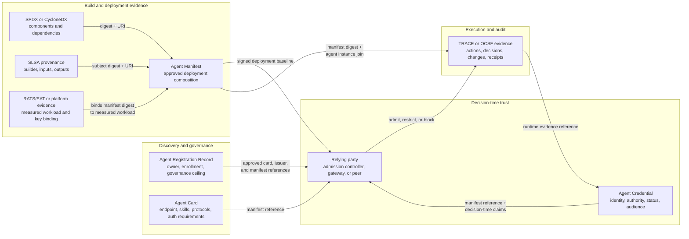

# Standards integration landscape

Agent Manifest is an integration point, not a replacement for an Agent Card,
credential, registration record, bill of materials, provenance statement,
attestation format, or runtime evidence. Each record keeps its existing owner and
lifecycle. Small, signed references connect them.

This page is informative. It describes the intended integration boundary and
does not add fields or conformance requirements to the Agent Manifest
specification.

## How the records relate



The arrows are references, not schema ownership transfers. Agent Manifest binds
the digests and identifiers needed to verify a deployment. It does not copy the
source records into a new umbrella schema.

## Record boundaries

| Record | Answers | Carries or references | Must remain outside it |
|---|---|---|---|
| Agent Registration Record | Which agent is enrolled, who owns it, and what governance ceiling applies? | Approved Agent Card, credential issuer, and manifest reference | Deployment internals and live authorization grants |
| Agent Card | Where is the agent and what protocols, skills, and authentication requirements does it advertise? | Manifest URI, digest, and media type | Secrets, live credentials, and deployment evidence copied from the manifest |
| Agent Credential | Who or what is presenting a claim, under whose authority, for which audience, and with what current status? | Exact manifest reference and, when needed, runtime-evidence reference | Prompt, model, tool catalog, BOM, and other deployment content |
| Agent Manifest | What immutable deployment composition was approved before execution? | Typed digests and URIs for the BOM, provenance, Agent Card or identity context, policy, tools, model, and attestation evidence | Discovery metadata, credential lifecycle state, live delegation grants, and actions that have not happened |
| SPDX or CycloneDX BOM | Which software, model, dataset, service, and dependency components are declared? | Component identities, relationships, and hashes | Agent identity, authority, and runtime decisions |
| SLSA provenance | How was an output built, from which inputs, by which builder? | Subjects, materials, builder, and process evidence | Agent policy, authority, and runtime behavior |
| RATS/EAT or platform evidence | Which workload measurement and key binding did the platform attest? | Platform claims, measurements, nonce or freshness evidence, and bound data | Semantic description of every agent artifact |
| TRACE or OCSF runtime evidence | What was observed, evaluated, changed, or committed after admission? | Manifest digest, agent-instance identifier, action and decision records, integrity data | A claim that the record is complete or that observed behavior was correct |

## Minimal common reference

Agent Cards, credentials, and registration records should be able to carry the
same small reference. The carrier signs the reference according to its own
rules; the manifest retains its own signature and attestation binding.

```json
{
  "manifest_ref": {
    "uri": "https://agent.example/manifests/sha256:7e1f...9a02",
    "digest": "sha256:7e1f...9a02",
    "media_type": "application/agent-manifest+cose"
  }
}
```

The exact carrier fields remain work for the owning standards. The integration
invariant is that the URI is resolvable, the digest identifies the exact signed
bytes, and the media type selects the correct verifier. A mutable agent-level
URL without a digest is not enough for an audit or authorization decision.

## Verification sequence

At a relying party such as an admission controller, MCP gateway, or A2A peer:

1. Authenticate the registration record, Agent Card, or credential according
   to the carrier's rules.
2. Resolve `manifest_ref.uri` and confirm that the retrieved signed bytes match
   `manifest_ref.digest` and `manifest_ref.media_type`.
3. Verify the manifest's issuer authorization, signature or COSE envelope,
   validity window, revocation status, required artifact bindings, and required
   attestation.
4. Resolve and verify referenced BOM and provenance records when policy requires
   their contents, rather than treating a present digest as sufficient.
5. Apply local policy to admit, restrict, or block the requested operation. A
   `VALID` manifest establishes provenance, not permission.
6. Emit runtime evidence carrying the exact manifest digest and a distinct
   agent-instance identifier. A stable agent identity must not be substituted
   for a session or workload-instance identity.
7. For later credential decisions or audits, verify the runtime record
   independently and join it to the exact manifest used at admission.

## Lifecycle and change rules

| Change | Record that changes | Required consequence |
|---|---|---|
| Endpoint, advertised skill, or protocol changes | Agent Card | Reissue the card; update its registration reference if governance requires it |
| Owner, enrollment, or governance ceiling changes | Registration record | Reissue or update the registration record under registry policy |
| Identity, authority, audience, or status changes | Agent Credential | Issue, attenuate, refresh, revoke, or replace the credential |
| Prompt, policy, model, tool surface, approved context baseline, or dependency reference changes | Agent Manifest | Build and sign a new manifest; repeat attestation binding where the conformance level requires it |
| Build input or output changes | SLSA provenance and usually the Agent Manifest | Produce new provenance and bind its new subject or record digest |
| Component inventory changes | BOM and usually the Agent Manifest | Produce a new BOM and bind its new digest |
| Runtime task, memory, delegation hop, tool decision, or receipt occurs | Runtime evidence | Emit a new evidence record joined to the admitted manifest and agent instance |

## Security limits

- A signature protects record integrity. It does not prove completeness,
  correctness, or safe behavior.
- Platform attestation measures a workload boundary. It does not semantically
  measure provider-hosted models, external services, or every in-memory object.
- A manifest reference in a credential does not make the manifest an
  authorization token. The relying party still evaluates current authority and
  local policy.
- A runtime record that identifies only a stable agent cannot distinguish two
  concurrent or sequential instances. Runtime evidence needs an instance-scoped
  join key.
- Digests without retrieval, media-type selection, and content verification are
  identifiers, not completed verification.
- No confidential-computing platform provides custody-grade protection from an
  adversary that owns the physical hardware. Deployment claims must state their
  operator trust model.

## Related material

- [Agent Credentials integration](agent-credentials.md) describes the
  credential-to-manifest and runtime-evidence bridge in detail.
- [Agent Manifest specification](../../spec/agent-manifest-spec-v0.2.md) defines
  the normative manifest and verification behavior.
- [CoSAI WS4 Agent Manifest review](https://github.com/cosai-oasis/ws4-secure-design-agentic-systems/issues/149)
  carries the review and disposition record for this boundary.
