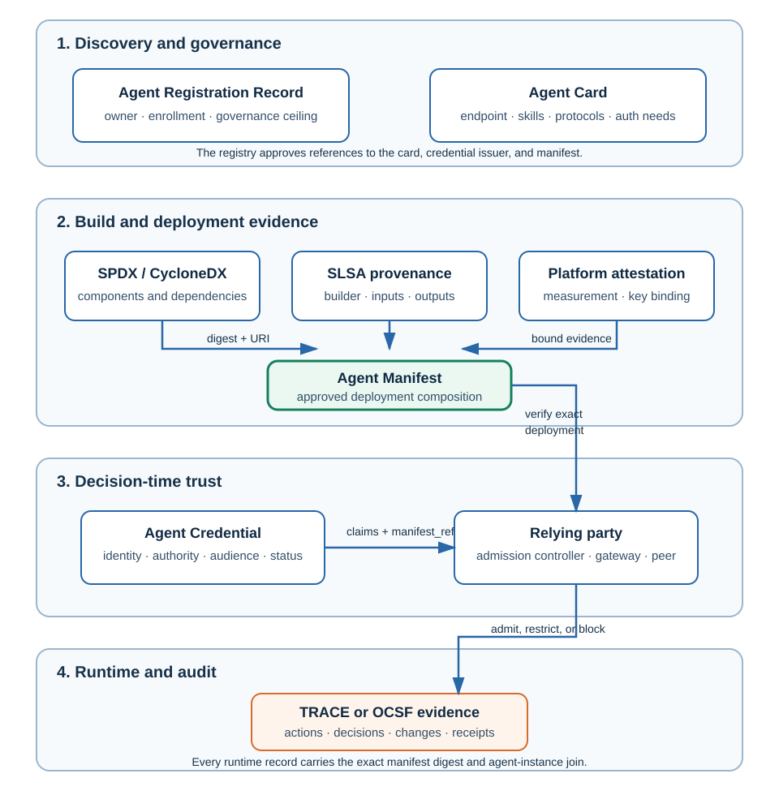

# Standards integration landscape

This page is for architects and standards readers who want to see where Agent
Manifest sits next to the other records about an AI agent. You get a map of
which record answers which question, and how they point to each other.

Agent Manifest links to these other records and does not replace any of them:
an Agent Card (the agent's public description of itself), a credential, a
registration record, a bill of materials (BOM, a list of the software parts),
a provenance statement (how something was built), a hardware attestation (a
signed report from the processor about what is running), or runtime evidence
(records of what the agent did). Each record keeps its existing owner and
lifecycle. Small signed references connect them.

This page is informative (guidance only). It describes the intended integration boundary and
does not add fields or conformance requirements to the Agent Manifest
specification.

## How the records relate

In simple terms:

1. **Discovery records say what the agent claims to be.** The registration
   record and Agent Card identify the owner, endpoint, skills, and protocols.
2. **Build records say what was approved.** The BOM, build provenance, and
   platform evidence are linked by exact digest from the Agent Manifest.
3. **A relying party makes the decision.** It checks the credential and the
   exact manifest, then admits, restricts, or blocks the agent.
4. **Runtime records say what happened next.** TRACE or OCSF evidence links each
   action back to the exact manifest and agent instance that was admitted.

<a href="../../assets/standards-integration-landscape.svg" target="_blank">
  
</a>

**[Open the diagram full size](../assets/standards-integration-landscape.svg)**
for readable labels. Select the image to open it in a new tab.

The arrows are references. No record takes ownership of another's format. Agent
Manifest holds the digests (fingerprints of exact bytes) and identifiers needed to
check a deployment. It does not copy the other records into one new combined
format.

## See it working

Pick the depth that fits the question you are trying to answer:

### Five minutes: prove deployment drift is detected

Run the [multi-artifact tamper-detection
example](https://github.com/agentrust-io/agent-manifest/tree/main/examples/multi-artifact).
It signs a manifest over a real prompt, model descriptor, tool catalog, and RAG
corpus, verifies the approved state, changes the prompt, and shows verification
returning `MISMATCH`.

```bash
git clone https://github.com/agentrust-io/agent-manifest
cd agent-manifest
bash examples/multi-artifact/verify.sh
```

### Fifteen minutes: follow declaration through enforcement to evidence

The [industrial embodied-AI
example](https://github.com/agentrust-io/integrations/tree/main/examples/industrial-embodied-ai)
connects all three layers in one scenario:

1. Agent Manifest declares the approved prompt, policy, tools, and artifact
   hashes.
2. cMCP, the gateway that sits in front of the agent's tools, checks each
   requested action against the active Cedar policy (a rules file) and tool
   catalog.
3. TRACE and the signed audit bundle preserve the session and decisions for
   offline verification after the processes stop.

The example includes allowed, out-of-scope, and independently safety-rejected
paths. Its limitations table states exactly what each record proves and what it
does not prove.

### Browse integrations and runnable demos

- [cA2A cross-operator delegation](https://github.com/agentrust-io/integrations/tree/main/integrations/agentrust-ca2a-cross-operator)
  is a runnable 12-check tutorial. It shows one agent giving another agent a
  smaller set of permissions, the receiving agent applying its own policy, and
  an auditor checking the delegation and evidence later. Its SEV-SNP evidence is
  synthetic, so it demonstrates the protocol without claiming a live hardware
  run.
- [AgenTrust demos](https://agentrust-io.com/demos/) provides ten runnable
  policy, attestation, TRACE, and model-custody demonstrations that need no
  confidential-computing hardware.
- [AgenTrust Marketplace](https://agentrust-io.com/marketplace/) lists open
  adapters, plugins, platforms, and evidence exporters. A listing helps you find
  a tool; it is not an endorsement. Check each listing and its evidence for your
  own deployment.
- [Your first manifest](../tutorials/your-first-manifest.md) walks through
  creation and signing, and [server-side
  verification](../tutorials/server-side-verification.md) shows the relying-party
  side of the diagram.

## Record boundaries

Each row is one kind of record: the question it answers, what it holds or
points to, and what it should not contain.

| Record | Answers | Carries or references | Must remain outside it |
|---|---|---|---|
| Agent Registration Record | Which agent is enrolled, who owns it, and what governance ceiling applies? | Approved Agent Card, credential issuer, and manifest reference | Deployment internals and live authorization grants |
| Agent Card | Where is the agent and what protocols, skills, and authentication requirements does it advertise? | Manifest URI, digest, and media type | Secrets, live credentials, and deployment evidence copied from the manifest |
| Agent Credential | Who or what is presenting a claim, under whose authority, for which audience, and with what current status? | Exact manifest reference and, when needed, runtime-evidence reference | Prompt, model, tool catalog, BOM, and other deployment content |
| Agent Manifest | What immutable deployment composition was approved before execution? | Typed digests and URIs for the BOM, provenance, Agent Card or identity context, policy, tools, model, and attestation evidence | Discovery metadata, credential lifecycle state, live delegation grants, and actions that have not happened |
| SPDX or CycloneDX BOM | Which software, model, dataset, service, and dependency components are declared? | Component identities, relationships, and hashes | Agent identity, authority, and runtime decisions |
| SLSA provenance | How was an output built, from which inputs, by which builder? | Subjects, materials, builder, and process evidence | Agent policy, authority, and runtime behavior |
| RATS/EAT or platform evidence | Which workload measurement and key binding did the platform attest? | Platform claims, measurements, nonce or freshness evidence, and bound data | Semantic description of every agent artifact |
| TRACE or OCSF runtime evidence | What was observed, evaluated, changed, or committed after admission? | Manifest digest, agent-instance identifier, action and decision records, integrity data | A claim that the record is complete or that observed behavior was correct |

## Minimal common reference

Agent Cards, credentials, and registration records should be able to carry the
same small reference. The carrier signs the reference according to its own
rules; the manifest retains its own signature and attestation binding.

```json
{
  "manifest_ref": {
    "uri": "https://agent.example/manifests/sha256:7e1f...9a02",
    "digest": "sha256:7e1f...9a02",
    "media_type": "application/agent-manifest+cose"
  }
}
```

The exact field names are for each owning standard to decide. What must always
hold: the URI can be fetched, the digest identifies the exact signed bytes, and
the media type tells the checker which verifier to use. A URL for the agent that
can change, with no digest, is not enough for an audit or an access decision.

## Verification sequence

A relying party is the service that decides whether to let the agent in or let
an action go ahead, such as an admission controller, an MCP gateway (in front of
tools) or an A2A peer (another agent). It checks in this order:

1. Authenticate the registration record, Agent Card, or credential according
   to the carrier's rules.
2. Resolve `manifest_ref.uri` and confirm that the retrieved signed bytes match
   `manifest_ref.digest` and `manifest_ref.media_type`.
3. Verify the manifest's issuer authorization, signature or COSE envelope,
   validity window, revocation status, required artifact bindings, and required
   attestation.
4. Resolve and verify referenced BOM and provenance records when policy requires
   their contents, rather than treating a present digest as sufficient.
5. Apply local policy to admit, restrict, or block the requested operation. A
   `VALID` manifest establishes provenance, not permission.
6. Emit runtime evidence carrying the exact manifest digest and a distinct
   agent-instance identifier. A stable agent identity must not be substituted
   for a session or workload-instance identity.
7. For later credential decisions or audits, verify the runtime record
   independently and join it to the exact manifest used at admission.

## Lifecycle and change rules

When something about the agent changes, this table shows which record has to be
reissued.

| Change | Record that changes | Required consequence |
|---|---|---|
| Endpoint, advertised skill, or protocol changes | Agent Card | Reissue the card; update its registration reference if governance requires it |
| Owner, enrollment, or governance ceiling changes | Registration record | Reissue or update the registration record under registry policy |
| Identity, authority, audience, or status changes | Agent Credential | Issue, attenuate, refresh, revoke, or replace the credential |
| Prompt, policy, model, tool surface, approved context baseline, or dependency reference changes | Agent Manifest | Build and sign a new manifest; repeat attestation binding where the conformance level requires it |
| Build input or output changes | SLSA provenance and usually the Agent Manifest | Produce new provenance and bind its new subject or record digest |
| Component inventory changes | BOM and usually the Agent Manifest | Produce a new BOM and bind its new digest |
| Runtime task, memory, delegation hop, tool decision, or receipt occurs | Runtime evidence | Emit a new evidence record joined to the admitted manifest and agent instance |

## Security limits

- A signature protects record integrity. It does not prove completeness,
  correctness, or safe behavior.
- Platform attestation measures a workload boundary. It does not semantically
  measure provider-hosted models, external services, or every in-memory object.
- A manifest reference in a credential does not make the manifest an
  authorization token. The relying party still evaluates current authority and
  local policy.
- A runtime record that identifies only a stable agent cannot distinguish two
  concurrent or sequential instances. Runtime evidence needs an instance-scoped
  join key.
- Digests without retrieval, media-type selection, and content verification are
  identifiers, not completed verification.
- No confidential-computing platform provides custody-grade protection from an
  adversary that owns the physical hardware. Deployment claims must state their
  operator trust model.

## Related material

- [Agent Credentials integration](agent-credentials.md) describes the
  credential-to-manifest and runtime-evidence bridge in detail.
- [Agent Manifest specification](../spec/agent-manifest-v0.2.md) defines
  the normative manifest and verification behavior.
- [CoSAI WS4 Agent Manifest review](https://github.com/cosai-oasis/ws4-secure-design-agentic-systems/issues/149)
  carries the review and disposition record for this boundary.
